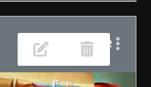
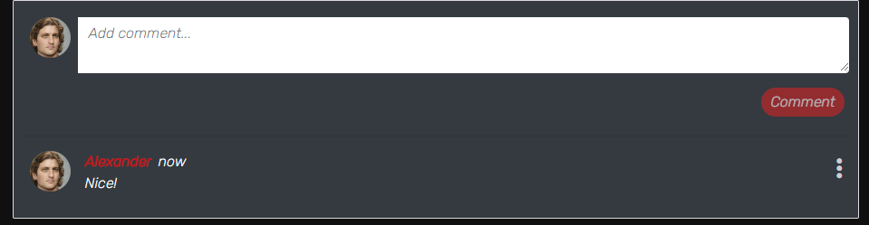

# Art Hub

Art Hub is a place for users from all over the world to share and view Art posts, like or dislike or comment opinions on a certain post.
It is designed to be a social space for artists or art lovers to get inspired or share inspirations with others.
Whether It's a painting a photograph or a sculpture Art Hub's goal is to make it easy to share with the rest of the world.
 

[Deployed Site](https://arthub-react.herokuapp.com/)
 

[API repository](https://github.com/Hijazi-alaa/My-api)

## Main functionalities

<ul>
<li>Costume DRF API is created to handle all the crud functionality for this application.

[DRF-API-repo](https://github.com/Hijazi-alaa/My-api)
</li>
<li>Main Navbar that contains a logo. and nav links depending on the status of the user (logged in/logged out</li>
<li>Users can sign up to make a profile and sign.</li>
<li>Users can create a post containing an image, title and a description of the post.</li>
<li>Users can edit theire own existing posts</li>
<li>Users can view everyone'sposts on the home page ordered by the latest uploads</li>
<li>Users can like or dislike a post.</li>
<li>Users can add a comment on a post, edit or delete own comments.</li>
<li>Users can search for posts using keywords or user profile name.</li>
<li>View all posts that a user have liked in Liked page</li>
<li>A profile page for each user that contains all posts uploaded by the user</li>
<li>A user can edit theire own profile Image, user name or password</li>
</ul>

## User Stories:

### Implemented user stories per sprint:
<ul>
<li>first sprint</li>
    <ol>
    <li>

[Navigation](https://github.com/Hijazi-alaa/art-hub/issues/1)
    </li>
    <li>
[Routing](https://github.com/Hijazi-alaa/art-hub/issues/2)
    </li>
    </ol>
<li>Second sprint</li>
    <ol>
    <li>

[Authentication Sign up](https://github.com/Hijazi-alaa/art-hub/issues/3)
    </li>
    <li>
[Authentication Sign in](https://github.com/Hijazi-alaa/art-hub/issues/4)
    </li>
    </ol>
    <li>Third sprint</li>
    <ol>
    <li>
[Create posts](https://github.com/Hijazi-alaa/art-hub/issues/5)
    </li>
    <li>
[Viewing recent posts](https://github.com/Hijazi-alaa/art-hub/issues/6)
    </li>
    <li>
[Post page](https://github.com/Hijazi-alaa/art-hub/issues/10)
    </li>
    <li>
[Like or unlike a post](https://github.com/Hijazi-alaa/art-hub/issues/19)
    </li>
    </ol>
      <li>Fourth sprint</li>
    <ol>
    <li>
[Home feed](https://github.com/Hijazi-alaa/art-hub/issues/9)
    </li>
    <li>
[View liked posts](https://github.com/Hijazi-alaa/art-hub/issues/8)
    </li>
    <li>
[Search for posts](https://github.com/Hijazi-alaa/art-hub/issues/7)
    </li>
    <li>
[Infinite scroll](https://github.com/Hijazi-alaa/art-hub/issues/20)
    </li>
    <li>
[Delete a post](https://github.com/Hijazi-alaa/art-hub/issues/21)
    </li>
    </ol>
    <li>Fifth sprint</li>
    <ol>
    <li>
[Edit  a post](https://github.com/Hijazi-alaa/art-hub/issues/11)
    </li>
    <li>
[Comment](https://github.com/Hijazi-alaa/art-hub/issues/12)
    </li>
    <li>
[Profile Page](https://github.com/Hijazi-alaa/art-hub/issues/13)
    </li>
    <li>
[User posts](https://github.com/Hijazi-alaa/art-hub/issues/15)
    </li>
    <li>
[Edit profile](https://github.com/Hijazi-alaa/art-hub/issues/17)
    </li>
    <li>
[Update username and password](https://github.com/Hijazi-alaa/art-hub/issues/18)
    </li>
    </ol>
</ul>

Other user stories that were not included due to time limitations and could be implemented in the future:
<ul>
    <li>

[Follow/Unfollow](https://github.com/Hijazi-alaa/art-hub/issues/16)
    </li>
    <li>
    
[Most followed profiles](https://github.com/Hijazi-alaa/art-hub/issues/14)
    </li>
</ul>

Other potential features that could be included in the future:
<ul>
<li>Ability to share other users posts</li>
<li>Show most liked posts as the most popular in the application</li>
<li>Require email for sign up.</li>
</ul>

## Design

The design is inspired by most social media websites and took reference from the Code institute Moment project

Used [Figma](https://www.figma.com/) to create a mockup of the main page

Fonts used  [google fonts](https://fonts.google.com/):
<ul>
<li>Koulen</ul>
<li>Roboto</ul>
<li>Rubik</ul>

Icons used [font awsome](https://fontawesome.com/)

Logo and favicon designed using [Hatchful](https://hatchful.shopify.com/)

## Testing

### Validation
All Files went through the ESLint extension with no issues.

### Manual Testing
 
<ul>
<li>Nav bar links: tested by clicking on each individual link and made sure that clicking on a link leads to the right URL and that routing is working where the page does not refresh</li>
 

  
<li>Teste an invalid URL in the browser and made sure it leads to the page not found message</li>
 

 
<li>Tested sign up form validation by submitting an empty fields to confirm form validation error message would appear</li>
 

 
<li>Tested providing different values for password 1 and 2 fields to confirm that form validation message would appear</li>
 

 
<li>Tested signing up for working by creating a new profile and made sure it redirects the user to the sign-in form URL</li>
<li>Confirmed that my application is sending data to the deployed back-end DRF API after signing up a new account, and confirming the data was added to the API database in heroku</li>
<li>Tested signing in with an existing account and confirmed it redirects user to home page URL when user submit</li>
<li>Tested sign-in form validation by submitting empty field and confirm user would recive a form validation message</li>
<vr>

 
<li>Tested sign in form validation by trying to sign in with a none existing username or wrong password and confirm that users would recive a form validation message</li>
 

 
<li>Tested that navbar reflect the user status if Loggedin/none logged in</li>
 

 

<li>Tested if axios toeken interceptors refreshing tokens by signing in and remain idle for over 5 minutes and confirmed the user is not logged out.</li>
<li>Tested that sign out link in the navbar loges out user and redirects to Home page URL</li>
<li>Tested the useClickOutsideToggle hook by oppening the application in a small screen size. the navbar closes when clicking outside or when selecting a nav link.</li>
<li>Tested Add a post by uloading an image and changing the image before saving.</li>
<li>Tested that adding a post is sending data to the API when saving uploading image.</li>

<li>Tested validation of add a post form by trying to submit without a title, or without uploading an image, or wrong type of files instead of an image</li>
 

 
<li>Tested fetching a post by ID from the API and rendering in a post page.</li>

<li>Tested if all posts appearing in home page ordered by most recent first.</li>
<li>Tested that only logged in users can like a post, and a post owner can not like his/her own posts.</li>
<li>Tested to like and unlike a post, and liked a post by diffrent users to confirm that the count like is increasing when liked and decreasing when a user unlikes</li>

<li>Tested the liked posts page only show the posts that a user have liked.</li>
<li>Tested the search bar returns results matching keyword or username that the user enters</li>

<li>Tested infinite scroll keep fetching posts by uploading over 10 posts and scrolling.</li>
<li>Tested drop down menu for posts only shows for the post owner.</li>
<li>Tested the delete button in the drop-down menu for posts deletes a post from the database and redirects the user to the previous page</li>

<li>Tested that user can edit a post by clicking on the edit a post in the drop down menu and checked if the edit form change the post after submitting.</li>
<li>Testet that only a logged in user can add a comment into a post.</li>
<li>Tested that submitting a comment adds a comment and saves it to the relevnt post page</li>

<li>Tested that users can edit or delete their own comments and only the owner can do that.</li>
<li>Tested that adding a comment increases the count next to the comment icon and deleting a comment decreases it</li>
<li>Tested that infinite scroll works for comments by adding over 20 comments into a post and scrolling down to fetch more posts as i scroll.</li>
<li>Tested that the profile page shows all posts posted by the profile owner.</li>
<li>Tested that the Profile page shows the right profile, and that the stats show the right number of posts created by the profile owner</li>

<li>Tested that editing a profile form works, by changing bio and uploading a profile image or changing an existing image</li>

<li>Tested changing username form in the profile drop down menu and confirmed its working.</ul>

<li>Tested changing a username password form from the profile drop down menu, and the form validation.</ul>

<li>Tested that re-directing works and direct the user to the intended URL.</li>
</ul>

## Deployment

<ol>
<li>Started an empty workspace and created a react app with the command:
<strong>npx create-react-app . --use-npm</strong>
</li>
<li>Checked if the app is working as it should, and placed a placholder text.</li>
<li>Added, commited and pushed to github.</li>
<li>Created a new app in heroku.com</li>
<li>Back in my worspace, i installed the heroku cli with the command:
<strong>npm install -g heroku</strong></li>
<li>Entred the command <strong>heroku login -i</strong> and entred my username and password</li>
<li>Then connected to my heroku application remotly by entering the command: <strong>
heroku git:remote -a arthub-react (my app name on heroku)</strong></li>
<li>Pushed to heroku with the command: <strong>git push heroku main</strong></li>
<li>Updated the config vars in my DRF-API on heroku: the client origin dev and provided my react app workspace URL, and the client origin and provided it with the URL for my react application deployed at heroku.</li>
<li>Installed axios and created axiosdefault.js/api and defined my default baseURL for my DRF-API and the content type.</li>
<li>When the application was finished repeated steps (3 to 8)</li>
</ol>

## Credits and dependencies
#### dependencies
<ul>
<li>React Boostrap</li>
<li>react-router-dom</li>
<li>axios</li>
<li>react-infinite-scroll-component</li>
</ul>

#### credits
<ul>
<li>The Code institute's react moment project was a huge point of reference on so many points while writing my application.</li>
<li>My mentor Rohit Sharma provided much appreciated guidance</li>
<li>Code instiute's Tutor Assistance for providing help through out the project</li>
</ul>

The entire project was a great experience with that said there is much yet for me to learn, and expand on this application considering due to the short available time I had to finish both the back and the front end in one week.